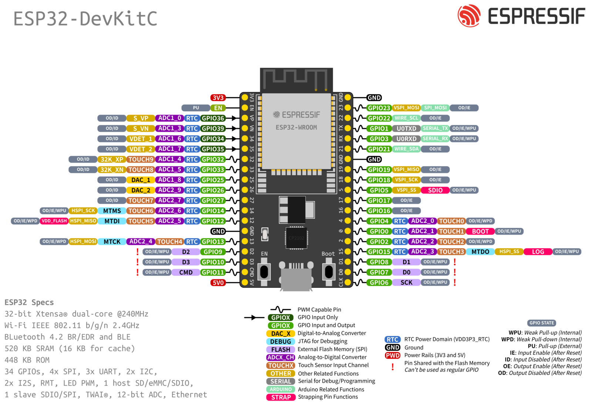
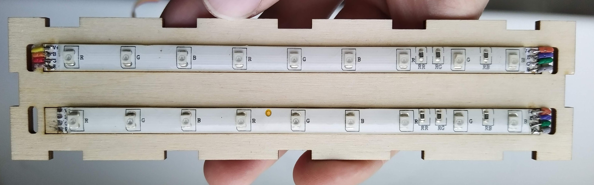
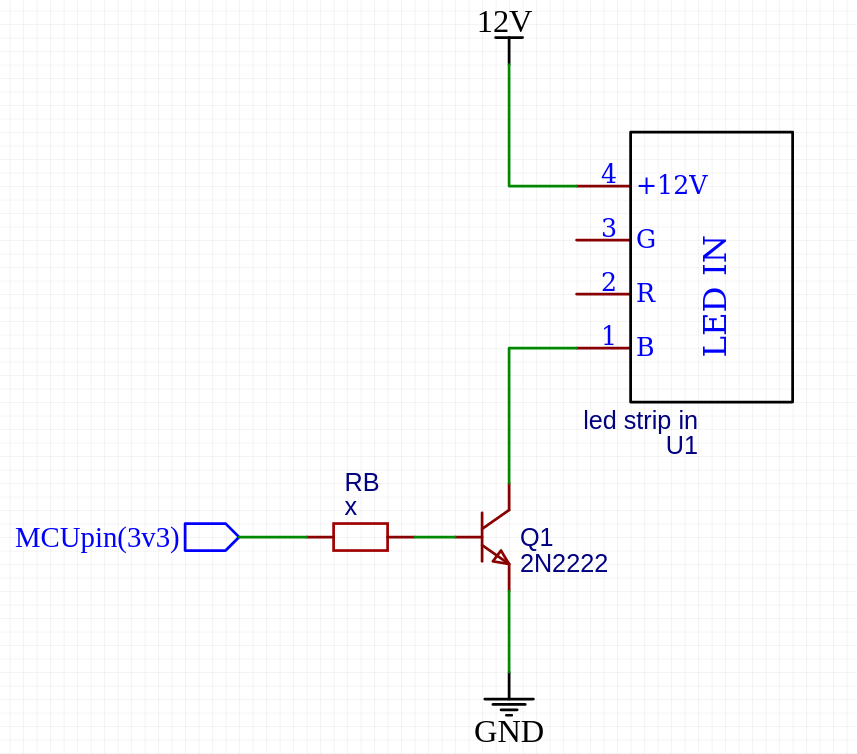

# ESP32 + 12v LED + ROS2

## 1. Hardware

### 1.2 ESP32 Pinout

### 1.3 12v LED stripe

Letter|Current|Color|Resistor|R value
------|-------|-----|--------|-------
B     |0,028A |Green|151     |150Ω
G     |0,034A |Red  |331     |330Ω
R     |0,030A |Blue |151     |150Ω

### 1.4 LED driver

- RB - Base resistance
- hFE - min. current gain value
- RL - Load resistance

$$R_B=0.2*R_L*hFE$$

$$R_B1=0.2*150Ω*100=3000Ω$$

$$R_B2=0.2*350Ω*100=6600Ω$$

## 2. Software

### 2.1 LED PWM

- The ESP32 has a LED PWM controller with 16 independent **channels** (0-15).
- Set the PWM signal **frequency**. 5000 Hz is fine for LEDs.
- Set the signal’s duty cycle **resolution** from 1 to 16 bits. 8-bit resolution means values are from 0 to 255.
- **Output pins** available and safe to use: `2`, `4`, `5`, `12`, `13`, `14`, `15`, `16`, `17`, `18`, `19`, `21`, `22`,`23`, `25`, `26`, `27`, `32`, `33`.

Example code: [PWM.cpp](examples/pwm.cpp).

## Links

- [micro-ROS puts ROS 2 onto microcontrollers](https://micro.ros.org/)
- [micro-ROS for PlatformIO](https://github.com/micro-ROS/micro_ros_platformio)
- [Driving an LED using a Transistor](https://www.petervis.com/Raspberry_PI/Driving_LEDs_with_CMOS_and_TTL_Outputs/Driving_an_LED_Using_Transistors.html)
- [ESP32 LED PWM Controller](https://randomnerdtutorials.com/esp32-pwm-arduino-ide/)
- [ESP32 Pinout Reference](https://randomnerdtutorials.com/esp32-pinout-reference-gpios/)

___________

Tauno Erik 06.11.2022
